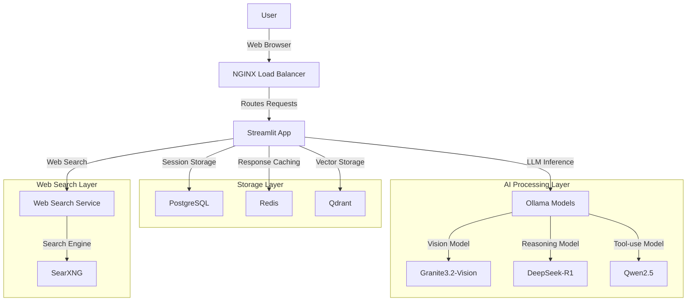

# Scalable LLM Chatbot System

## Overview

The Scalable LLM Chatbot System is a robust, high-performance conversational AI platform designed to support large-scale interactions. It enables seamless conversations with multiple LLMs while maintaining context and reliability, with architecture designed to scale to support thousands of users.

## Features

- **Multi-Model Support**: Integration with DeepSeek-R1 (1.5B), Qwen2.5 (7B), and Granite3.2-Vision through Ollama
- **Multimodal Capabilities**: Support for text and image queries via Granite3.2-Vision
- **Purpose-Specific Models**:
  - _Granite3.2-Vision_: Handles image analysis and vision-based queries
  - _DeepSeek-R1_: Optimized for coding tasks with "thinking" token functionality
  - _Qwen2.5_: Supports tool use including web search and calculator functions
- **Factual Evaluation**: Automated assessment of LLM-generated content with web search results
- **Smart Caching**: Redis-based response caching to reduce redundant LLM calls
- **Context Management**: Persistent conversation history with PostgreSQL and Redis
- **Microservices Architecture**: Docker-based deployment with clean service separation

## System Architecture

The system implements a microservices architecture with containerized components connected through a secure internal network.



### Component Breakdown

- **Presentation Layer**:

  - **NGINX**: Acts as reverse proxy and load balancer, handling all incoming client connections
  - **Streamlit App**: Provides the interactive user interface and orchestrates backend services

- **Storage Layer**:

  - **PostgreSQL**: Persistent storage for user sessions, chat history, and app state
  - **Redis**: High-performance caching for recent context and response caching
  - **Qdrant**: Vector database for similarity search and embedding storage

- **AI Processing Layer**:

  - **Ollama**: Local model serving platform that hosts multiple LLMs
  - **LLM Models**: Purpose-specific models for different tasks:
    - _DeepSeek-R1_: 1.5B parameter model with thinking token support
    - _Qwen2.5_: 7B parameter model with tool integration capabilities
    - _Granite3.2-Vision_: Multimodal model for image processing

- **Tool Layer**:
  - **Web Search Service**: Custom-built microservice for retrieving information from the web. It uses **SearXNG**, a metasearch engine for finding URLs.
  - **Calculator Service**: Built-in calculator tool for numerical computations.

## Technical Focus Areas

### 1. System Architecture

The system is built on a microservices architecture, with each component containerized using Docker and orchestrated with Docker Compose (with Kubernetes readiness for production deployment).

**Key Architectural Decisions**:

- **Service Isolation**: Each component runs in its own container with defined resource limits, preventing cascading failures.
- **Internal Network**: Services communicate over a private Docker network, with only NGINX exposed to the outside world.
- **Health Checks**: Integrated health monitoring for all critical services.
- **Resource Management**: Container-level CPU and memory limits prevent resource contention.

**Component Interactions**:

- The Streamlit app serves as the central orchestrator, connecting user interfaces with backend services.
- PostgreSQL maintains persistent chat history and user session data.
- Redis provides high-speed caching for recent conversation context and response caching
- Ollama hosts multiple language models accessed via API calls. This can be replaced by vLLM but it does not permit multiple model hosting on a single GPU whereas Ollama does.
- Specialized microservices handle web search and calculation tasks.
- Custom evaluation logic assesses factual accuracy by validating generated content against web search results.

### 2. Scalability

The system is designed to scale both vertically and horizontally to handle increasing user loads.

**Load Handling Strategy**:

- **Response Caching**: Identical queries receive cached responses, dramatically reducing LLM calls and response times for users.
- **Connection Pooling**: Database connections are pooled to handle concurrent requests efficiently
- **Asynchronous Processing**: Long-running operations like web searches run asynchronously
- **Stateless Design**: Application containers are stateless, enabling easy horizontal scaling

**Scaling to 10,000+ Users**:

- **Horizontal Scaling**: The Streamlit app can be replicated across multiple instances, with NGINX distributing traffic
- **Database Sharding**: PostgreSQL can be sharded by geolocation of the user for distributed data storage and faster access in the region
- **Read Replicas**: Database read replicas can be added to handle query-heavy workloads
- **Redis Cluster**: Redis can be configured as a cluster for distributed caching
- **Model Deployment Strategies**:
  - Multiple vLLM (one per model, each individually scalable) instances can be deployed to distribute model inference load. Ollama was used due to local machine constraints for hosting multiple models and inbuilt queue management.
  - Smaller specialized models reduce resource requirements per request and increase throughput speed.

**Potential Bottlenecks and Solutions**:

- **LLM Inference**: The most resource-intensive component
  - Solution: Batch similar requests, implement queue management, and scale using vLLM horizontally.
- **Web Search Latency**:
  - Solution: Parallel request processing and caching of search results

**Horizontal vs. Vertical Scaling Strategy**:

- **Horizontal Scaling** (Adding more instances):
  - App containers can be replicated and load-balanced
  - Ollama instances can be distributed by model type across multiple nodes
  - Database read replicas can be added for query distribution
- **Vertical Scaling** (Increasing resources per instance):
  - Ollama containers can be allocated more GPU/CPU resources for faster inference
  - Database servers can be upgraded for higher throughput
  - Resource-intensive operations like vision model inference can be given priority access to compute resources

### 3. Reliability

The system incorporates multiple reliability mechanisms to ensure consistent operation.

**Failure Handling**:

- **Container Restart Policies**: All services use "unless-stopped" restart policies to auto-recover from crashes
- **Health Checks**: Integrated health monitoring prevents routing to failed services
- **Dependent Service Checks**: Services wait for dependencies to be healthy before starting
- **Graceful Degradation**: If specialized tools become unavailable, the system falls back to base LLM capabilities

**Service Quality Maintenance**:

- **Response Validation**: AI-generated responses from web searches are evaluated for factual accuracy
- **Highlighting Inaccuracies**: Potentially incorrect information is highlighted for user awareness
- **Session Persistence**: Conversations survive service restarts through PostgreSQL storage
- **Context Management**: Redis maintains recent conversation context to ensure coherent responses
- **Error Boundary Handling**: Streamlit components are designed to fail independently without crashing the entire application

**Monitoring and Observability**:

- **Current Logging:** Currently logging has been implemented only for error detection in containers and not for resource usage. Prometheus and Grafana can be used for tracking resource ustilization.

### 4. Cost Considerations

The system is designed with cost efficiency as one of the core principle.

**Operational Cost Management**:

- **Resource Allocation**: Container-level CPU and memory limits prevent over-provisioning
- **Response Caching**: Redis caching reduces redundant LLM calls for common queries
- **Selective Model Usage**: Purpose-specific models minimize resource usage:
  - Small 1.5B parameter model (DeepSeek-R1) for coding tasks
  - Vision model only activated when images are present
  - Larger model (Qwen2.5) only used when tool capabilities are required
- **Local Model Deployment**: On-premises Ollama (vLLM in prod) deployment eliminates API costs for organizations with existing hardware. This can be determined based on the usage. Like the current implementation of chatbot requires multiple calls for answering one query and then re-evaluating the answer generated. In such cases it is usually better to have a self hosted LLM. A self hosted LLM can easily offer savings if it is optimally utilizing GPUs.

**LLM Efficiency Considerations**:

- **Prompt Engineering**: Carefully designed prompts to minimize token usage and batching of the evaluate function queries for improved load management.
- **Context Pruning**: Only relevant recent context is retained to reduce token consumption
- **Quantized Models**: Using efficient 4-bit quantized models reduces memory and compute requirements.
- **Inference Optimization**: Streaming responses provide faster perceived performance to the user.

**Scaling Cost Management**:

- **Auto-scaling Rules**: Resources can be automatically and individually scaled up or down based on demand (with Kubernetes).
- **Off-peak Scaling**: Reduced resource allocation during low-usage periods.
- **Caching Tiers**: Multi-level caching strategy with Redis for responses and PostgreSQL for persistent history.

### 5. ML/AI Integration

The system leverages multiple AI models and techniques for optimal performance.

**LLM Integration Strategy**:

- **Multi-Model Approach**: Different models for different task types:
  - DeepSeek-R1: Lightweight model with thinking tokens for step-by-step reasoning.
  - Qwen2.5: Tool-using model for web search and calculations.
  - Granite3.2-Vision: Vision capabilities for image analysis.
- **Model Selection Logic**: Model can be selected by the user based on query type and content.
- **Unified API Layer**: Consistent interface across different models for simplified integration.

**Context Management and Prompt Engineering**:

- **Contextual Storage**: Recent conversation history stored in Redis for fast retrieval.
- **Sliding Context Window**: Dynamic context window which prioritizes short term information (the previous few messages) to improve performance.
- **Specialized Prompts**: Custom prompts for different operations:
  - Tool selection prompts for identifying required external tools.
  - Evaluation prompts for assessing response accuracy.
  - Vision-specific prompts for image analysis.
- **Structured Output Formats**: JSON response formatting for tool requests and evaluations.

**Advanced Techniques**:

- **Tool Use**: Integration with web search and calculator functions
- **Response Evaluation**: Automated fact-checking of generated content against web sources
- **Streaming Responses**: Token-by-token streaming for improved user experience
- **Thinking Tokens**: Explicit reasoning steps with DeepSeek-R1 to improve response quality
- **Web Search Integration**: Retrieval-Augmented Generation using real-time web data

**Performance Optimization and Latency Considerations**:

- **Token Streaming**: Progressive response display reduces perceived latency
- **Parallel Processing**: Simultaneous execution of tool operations and model inference
- **4-bit Quantization**: Reduced precision models for faster inference
- **Efficient Prompt Design**: Minimizing input token count while preserving instruction clarity
- **Response Caching**: Previously generated responses are stored for immediate retrieval

**Response Quality Evaluation**:

- **Statement-Level Analysis**: Breaking responses into individual statements for granular evaluation
- **Evidence Comparison**: Validating statements against web search evidence
- **Confidence Scoring**: Assigning confidence levels to accuracy assessments
- **Visual Highlighting**: Color-coding potentially inaccurate information for user awareness
- **JSON Structured Evaluation**: Standardized format for assessment results

**Failure and Fallback Strategy**:

- **Graceful Degradation**: If specialized tools fail, system falls back to base LLM capabilities
- **Model Switching**: Alternative models can be selected if primary model fails
- **Default Responses**: Pre-defined responses for common failure scenarios
- **Error Classification**: Categorizing failures to determine appropriate fallback actions
- **Transparent Error Handling**: Clear communication to users when systems encounter limitations

## Deployment

1. **Prerequisites**:

   - Docker and Docker Compose installed
   - At least 16GB RAM and 8 GB VRAM recommended
   - 20GB+ disk space for models and data

2. **Clone Repository**:

   ```sh
   git clone https://github.com/AravJain007/Scalable-Chatbot.git
   cd Scalable-Chatbot
   ```

3. **Docker Deployment**:

   ```sh
   docker-compose up --build
   ```

4. **Install Ollama Models**:

   ```sh
   docker exec ollama ollama run deepseek-r1:1.5b
   docker exec ollama ollama run qwen2.5
   docker exec ollama ollama run granite3.2-vision
   ```

5. **Access the Application**:
   - Open your browser and navigate to `http://localhost:80`
   - Register an account and start chatting

## Future Work

- **Kubernetes Deployment**: While the current implementation uses Docker Compose, the architecture is designed to be Kubernetes-ready for production deployment with enhanced scalability
- **Additional LLM Integration**: Support for more models and model providers
- **User Feedback Loop**: Incorporating user feedback for continuous improvement

## Note on Current Deployment

The current implementation runs on Docker Compose due to local development constraints. The architecture is designed to be Kubernetes-compatible, and a Kubernetes deployment would be recommended for production environments to leverage advanced features like auto-scaling, load balancing, and advanced monitoring.
